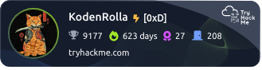
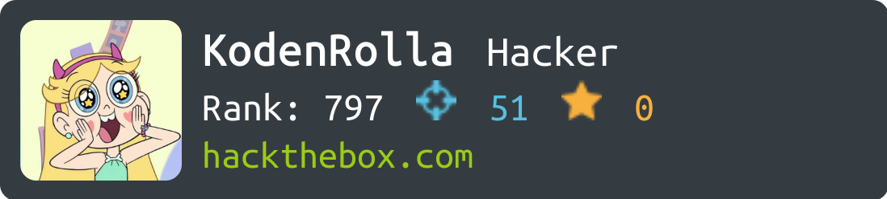

<!-- ### Hi there 👋 -->

<!--

  

  
  
  
  

  

-->
<h1 align='center'>Hey 👋</h1>

  <table style="border: none; border-collapse: collapse;">
    <tr>
      <td valign="bottom" width="60%" style="border: none;">
  <h3>💽 Whoami:</h3>
  <ul>
    <li>:suspect: Security Researcher</li>
    <li>🧬 Web3 & Decentralization fan</li>
    <li>🤙 Chill dude</li>
  </ul>
  
  <h3>🧠 My Ops:</h3>
  <ul>
    <li>💡 Web & Cloud Penetration Testing ☁️</li>
    <li>&#128270; Web3 Bug Bounty Hunting </li>
    <li>:computer: Writing about technology and security on <a href='https://kode-n-rolla.hashnode.dev/'>Hashnode</a> and <a href='https://medium.com/@k0d3-n-r011a'>Medium<a></li>
  </ul>
  
  <h3>💾 By me:</h3>
  <ul>
    <li>Python ➝‬ <a href='https://github.com/Kode-n-Rolla/sara'>SARA</a>, <a href='https://github.com/Kode-n-Rolla/json_cli_filter'>JSON CLI filter</a></li>
    <li>Solidity ➝‬ <a href='https://github.com/Kode-n-Rolla/web3/tree/main/own_kodes/cryptozombies'>CryptoZombies</a></li>
    <li>Go ➝‬ <a href='https://github.com/Kode-n-Rolla/deobfu'>DeObFU</a></li>
    <li>Multi langs ➝‬ <a href='https://github.com/Kode-n-Rolla/evil-kodes'>here</a></li>
  </ul>
  
  </td>
  <td valign="middle" width="50%" align="center" style="border: none;">
    
  
    
  </td>
  </tr>
  </table>

<!--
-  🤯 Created <a href='https://github.com/Kode-n-Rolla/sara'>SARA</a>, an offensive security tool for efficiently finding endpoints
-  🪢 Koded <a href='https://github.com/Kode-n-Rolla/deobfu'>DeObFU</a> for deobfuscate strings
-  🦾 Developed <a href='https://github.com/Kode-n-Rolla/json_cli_filter'>json cli filter</a>, a tool for filtering objects in JSON file 

 - :mailbox: How to reach me: 

---

⚡ Tech Stack:

  &nbsp;
  &nbsp;
  &nbsp;

  &nbsp;
  &nbsp;
  &nbsp;
  &nbsp;
  &nbsp;
  &nbsp;
  &nbsp;
  &nbsp;

  &nbsp;
  &nbsp;
  &nbsp;
  &nbsp;
  &nbsp;
  &nbsp;
  &nbsp;

---

✨ My Stats :

 -->

<!--<h2 align="center">
  Best wishes!
  
</h2>-->

<!--
**Kode-n-Rolla/Kode-n-Rolla** is a ✨ _special_ ✨ repository because its `README.md` (this file) appears on your GitHub profile.
&nbsp;
&nbsp;
&nbsp;
&nbsp;
&nbsp;>

&nbsp;
&nbsp;
<!-- 

### :man_technologist: 
### :hammer_and_wrench: 
### :fire: 
Here are some ideas to get you started:

- 🔭 I’m currently working on ...
- 🌱 I’m currently learning ...
- 👯 I’m looking to collaborate on ...
- 🤔 I’m looking for help with ...
- 💬 Ask me about ...
- 📫 How to reach me: ...
- 😄 Pronouns: ...
- ⚡ Fun fact: ...

- :zap:
Heavy

For count views profile

Icons Tools
https://github.com/devicons/devicon/tree/master/icons

Emoji
https://github.com/ikatyang/emoji-cheat-sheet/blob/master/README.md
